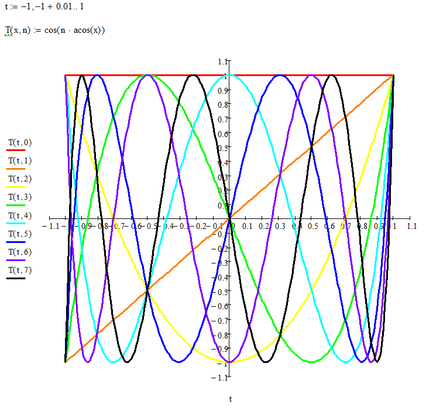

# Полиномы Чебышева

#### 1) Вычислить и показать графически первые 8 полиномов Чебышева 1 рода двумя способами: 1 - по схеме Горнера 2 - по тригонометрической формуле
[Реализация на языке C++](task1.cpp)

#### 2) Вычислить (двумя способами) полином Чебышева 60 степени и нарисовать его график
[Реализация на языке C++](task2.cpp)

#### 3) Найти нули, максимумы и минимумы полинома Чебышева 7-й степени численным методом и сравнить с аналитическим решением
[Реализация на языке C++](task3.cpp)